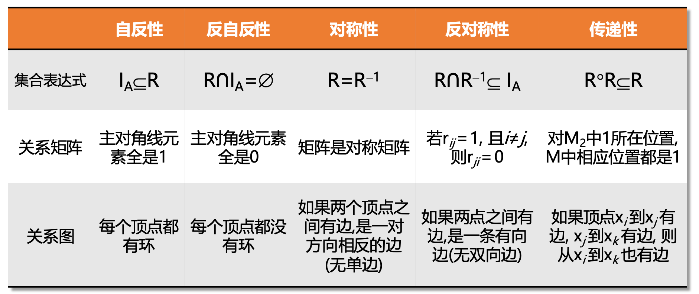

# Lecture 2 二元关系

## 一、 有序对及其性质

**定义**：由两个元素 $x$ 和 $y$（允许 $x=y$），按照**特定的顺序**排列成的二元组，称为有序对（或序偶），记作 $\langle x, y\rangle$。其中 $x$ 是第一元素，$y$ 是第二元素。
**有序对的相等条件**：$\langle x, y\rangle = \langle u, v\rangle$ 的**充分必要条件**是：$x = u$ 且 $y = v$ 。

## 二、 笛卡尔积 

**定义**：$A \times B = \{\langle x, y\rangle \mid x \in A \wedge y \in B\}$。

**基数计算**：如果集合 $A$ 有 $m$ 个元素（$|A| = m$），集合 $B$ 有 $n$ 个元素（$|B| = n$），那么根据排列组合的乘法原理：$|A \times B|= m \times n$ 。

!!! example "例题：幂集与空集"
    **题目**：设 $A=\{\emptyset\},\ B=\emptyset$，求 $P(A) \times A$ 和 $P(A) \times B$。

    **答案**：

    - $A=\{\emptyset\}$
    - $P(A)=\{\emptyset,\{\emptyset\}\}$
    - $P(A) \times A=\{\langle\emptyset,\emptyset\rangle,\langle\{\emptyset\},\emptyset\rangle\}$
    - $P(A) \times B=\emptyset$

**五大核心算律（必考选择/判断题）**：

1. 任何集合与空集的笛卡尔积都是空集：$A \times \emptyset = \emptyset,\ \emptyset \times A = \emptyset$。
2. **不满足交换律**：$A \times B \neq B \times A$ （除非 $A=B$ 或其中之一为空集）。
3. **不满足结合律**：$(A \times B) \times C \neq A \times (B \times C)$。
4. **对 $\cup$ 和 $\cap$ 满足分配律**：$A \times (B \cup C) = (A \times B) \cup (A \times C)$ （左分配、右分配均成立）。
5. **单调性**：若 $A \subseteq C \land B \subseteq D$，则 $A \times B \subseteq C \times D$。

## 三、 二元关系的定义 

### **什么是“关系”？**

- **严格定义**：如果一个集合满足以下两个条件之一，它就是一个“二元关系”（简称关系，记作 $R$）：

    - 它是空集 $\emptyset$。
    - 它的**每一个元素**都必须是“有序对”。
- **易错点辨析**：

    - $R_1 = \{\langle 1,2\rangle, \langle a,b\rangle\}$ 是关系吗？**是**。
    - $R_2 = \{\langle 1,2\rangle, a, b\}$ 是关系吗？**不是**。
- 如果有序对 $\langle x, y\rangle \in R$，记作 **$xRy$** （读作 $x$ 与 $y$ 有关系 $R$）。
- 如果 $\langle x, y\rangle \notin R$，就表示 $x$ 与 $y$ **没有关系 $R$**。
- 设 $A, B$ 为集合，$A \times B$ 的任何子集都是从 $A$ 到 $B$ 的关系。
- 当 $A = B$ 时，**$A \times A$ 的任何子集都称作“$A$ 上的二元关系”**。
- **推论**：如果集合 $A$ 有 $n$ 个元素（$|A|=n$），那么 $A$ 上不同的二元关系一共有：

    - $|A \times A| = n^2$ 个有序对。
    - 它的任何一个子集都是一个关系，所以关系总数是 **$2^{n^2}$**。
    - 例如 $A=\{0,1\}$，则 $A$ 上共有 $2^{2^2}=2^4=16$ 个不同的关系。

### **六大关系**：

对于任何集合 $A$：

1. **空关系 ($\emptyset$)**：什么关系都没有，最孤独的关系。
2. **全域关系 ($E_A$)**：$E_A = A \times A$。即 $A$ 里面的所有元素两两之间都有关系（包括自己和自己）。
3. **恒等关系 ($I_A$)**：$I_A = \{\langle x, x\rangle \mid x \in A\}$。
    - *白话解释*：每个元素**只和自己**有关系，绝对不和别人沾边。在关系矩阵里，就是主对角线全是 1，其他全是 0。

4. **小于等于关系 ($L_A$)**：$L_A = \{\langle x, y\rangle \mid x \le y\}$。
5. **包含关系 ($R_{\subseteq}$)**：$R_{\subseteq} = \{\langle x, y\rangle \mid x \subseteq y\}$。
6. **整除关系 ($D_A$)**：$D_A = \{\langle x, y\rangle \mid x \mid y\}$。
    - **注意**：$x \mid y$ 的意思是“$x$ 能整除 $y$”（即 $y$ 是 $x$ 的倍数）。例如 $2 \mid 4$ 成立，但 $4 \mid 2$ 不成立。

!!! example "例题：二元关系"
    **题目**：设 $A=\{1,2,3\}$，求 $A$ 上的小于等于关系 $L_A$ 和整除关系 $D_A$。

    **答案**：

    - $L_A=\{\langle 1,1\rangle,\langle 1,2\rangle,\langle 1,3\rangle,\langle 2,2\rangle,\langle 2,3\rangle,\langle 3,3\rangle\}$
    - $D_A=\{\langle 1,1\rangle,\langle 1,2\rangle,\langle 1,3\rangle,\langle 2,2\rangle,\langle 3,3\rangle\}$

### 关系的表示：

* **集合列举法**：列出所有有序对。
* **关系图 ($G_R$)**：用节点和有向边表示，$\langle x, y\rangle \in R$ 就是一条从 $x$ 指向 $y$ 的箭头。
* **关系矩阵 ($M_R$)**：如果 $x_i R x_j$（即元素 $x_i$ 到 $x_j$ 有关系），那么矩阵第 $i$ 行、第 $j$ 列的元素 $r_{ij} = 1$

## 四、 关系的七大运算

这部分是重中之重，尤其是“右复合”和“逆”。

**1. 单个关系的基础提取**

- **定义域 (dom$R$)**：所有有序对的**第一个元素**构成的集合。
- **值域 (ran$R$)**：所有有序对的**第二个元素**构成的集合。
- **域 (fld$R$)**：$\text{dom}R \cup \text{ran}R$。

**2. 进阶运算（重难点）**

- **逆关系 ($R^{-1}$)**：把所有箭头的方向反过来。$R^{-1} = \{\langle y, x\rangle \mid \langle x, y\rangle \in R\}$。
    - *定理*：$(R^{-1})^{-1} = R$，$\text{dom}(R^{-1}) = \text{ran}R$。

- **右复合 ($F \circ G$)**：相当于“先走 $F$，再走 $G$”。
    - 定义：$F \circ G = \{\langle x, y\rangle \mid \exists t (\langle x, t\rangle \in F \land \langle t, y\rangle \in G)\}$。
    - *定理*：$(F \circ G)^{-1} = G^{-1} \circ F^{-1}$。

- **限制**：记作 $R \upharpoonright A$。意思是把关系 $R$ 的出发点（第一元素）强行限制在集合 $A$ 的范围内，不在 $A$ 里面的出发点连同它的有向边一起砍掉。$R \upharpoonright A = \{\langle x, y\rangle \mid xRy \wedge x \in A\}$。
- **像**：记作 $R[A]$。意思是在经过上述“限制”之后，剩下的这些有效路径能到达的所有终点（第二元素）的集合。
- **公式**：$R[A] = \text{ran}(R \upharpoonright A)$。（即限制之后求值域）。

## 五、 关系运算的优先级

1. **最高优先级**：逆运算 ($^{-1}$)。
2. **第二优先级**：所有的关系运算（右复合 $\circ$、限制 $\upharpoonright$、像 $[]$）。
3. **最低优先级**：集合的运算（并 $\cup$、交 $\cap$、相对补 $-$、对称差 $\oplus$）。
4. **有括号永远先算括号**。

## 六、 关系运算律 
### 1. 逆运算与复合的结合
* **逆的逆**：$(F^{-1})^{-1} = F$。
* **定义域与值域互换**：$\text{dom}(F^{-1}) = \text{ran}F$，$\text{ran}(F^{-1}) = \text{dom}F$。
* **结合律**：$(F \circ G) \circ H = F \circ (G \circ H)$。（复合运算可以随意加括号，但**绝对不能调换左右位置**！）
* **复合的逆**：$(F \circ G)^{-1} = G^{-1} \circ F^{-1}$。

### 2. 恒等关系的“数字1”特性
* 对任何关系 $R$，都有 $R \circ I_A = I_A \circ R = R$。

### 3. 对 $\cup$ 和 $\cap$ 的分配律
* **遇到并集 ($\cup$) 永远是等号 ($=$)**：

    * $F \circ (G \cup H) = (F \circ G) \cup (F \circ H)$
    * $(G \cup H) \circ F = (G \circ F) \cup (H \circ F)$
    * $F \upharpoonright (A \cup B) = (F \upharpoonright A) \cup (F \upharpoonright B)$
    * $F[A \cup B] = F[A] \cup F[B]$

* **遇到交集 ($\cap$) 绝大多数是子集 ($\subseteq$)**：

    * $F \circ (G \cap H) \subseteq (F \circ G) \cap (F \circ H)$ **（极其容易出证明题！）**
    * $(G \cap H) \circ F \subseteq (G \circ F) \cap (H \circ F)$
    * $F[A \cap B] \subseteq F[A] \cap F[B]$
    * **唯一例外**：限制运算对交集是等号。$F \upharpoonright (A \cap B) = (F \upharpoonright A) \cap (F \upharpoonright B)$。

!!! example "例题：逆关系与关系复合"
    **题目**：设 $F=\{\langle 3,3\rangle,\langle 6,2\rangle\}$，$G=\{\langle 2,3\rangle\}$。求 $F^{-1}$、$F \circ G$、$G \circ F$。

    **答案**：

    - $F^{-1}=\{\langle 3,3\rangle,\langle 2,6\rangle\}$
    - $F \circ G=\{\langle 6,3\rangle\}$
    - $G \circ F=\{\langle 2,3\rangle\}$

!!! example "例题：关系的限制与像"
    **题目**：已知关系 $R=\{\langle 1,2\rangle,\langle 1,3\rangle,\langle 2,2\rangle,\langle 2,4\rangle,\langle 3,2\rangle\}$。求 $R$ 在不同集合 $A$ 下的限制和像。

    **答案**：

    - 当 $A=\{1\}$ 时：
        
        - $R \upharpoonright \{1\}=\{\langle 1,2\rangle,\langle 1,3\rangle\}$
        - $R[\{1\}]=\{2,3\}$
    - 当 $A=\emptyset$ 时：
        
        - $R \upharpoonright \emptyset=\emptyset$
        - $R[\emptyset]=\emptyset$
    - 当 $A=\{2,3\}$ 时：
        
        - $R \upharpoonright \{2,3\}=\{\langle 2,2\rangle,\langle 2,4\rangle,\langle 3,2\rangle\}$
        - $R[\{2,3\}]=\{2,4\}$

## 七、 关系幂运算 

**1. 关系幂的定义**

- 0 次幂：$R^0 = I_A$ **（注意！任何关系的 0 次幂都是恒等关系，不是空集！）**
- 递推式：$R^{n+1} = R^n \circ R$。
- **物理意义**：$R^n$ 代表在关系图中，经过**恰好 $n$ 步**能到达的路径集合。

**2. 关系矩阵的幂计算（满分秘籍）**

- 求 $R^n$ 的关系矩阵，就是将矩阵 $M_R$ 自己乘 $n$ 次。
- **绝对注意**：这里的矩阵乘法是**布尔乘法（逻辑加和逻辑乘）**。即 $1+1=1$，绝对不能出现 2 及以上的数字！

**3. 幂的周期性定理**

- 在有穷集上，关系只能有有限个。所以不断求幂，最后一定会**陷入死循环（呈现周期性）**。
- 只要找到 $R^s = R^t$ ($s < t$)，那么序列就会以 $p = t-s$ 为周期循环。即 $R^{s+k} = R^{t+k}$。利用这一点可以瞬间化简类似于 $R^{100}$ 的超高次幂计算。

!!! example "题目：笛卡尔积与交集"
    **题目**：设 $A,B,C,D$ 是任意集合，求证
    $$
    (A \cap B)\times(C \cap D)=(A\times C)\cap(B\times D).
    $$

    **答案**：

    任取 $\langle x,y\rangle$，
    $$
    \begin{aligned}
    \langle x,y\rangle \in (A\cap B)\times(C\cap D)
    &\iff x\in A\cap B \land y\in C\cap D \\
    &\iff x\in A \land x\in B \land y\in C \land y\in D \\
    &\iff (x\in A \land y\in C)\land(x\in B \land y\in D) \\
    &\iff \langle x,y\rangle \in A\times C \land \langle x,y\rangle \in B\times D \\
    &\iff \langle x,y\rangle \in (A\times C)\cap(B\times D).
    \end{aligned}
    $$
    因此
    $$
    (A \cap B)\times(C \cap D)=(A\times C)\cap(B\times D).
    $$
    
!!! example "题目：关系的像集"
    **题目**：设 $R_i$ 是 $X$ 上的二元关系。对于 $x\in X$，定义
    $$
    R_i(x)=\{\,y\mid xR_i y\,\},
    $$
    显然 $R_i(x)\subseteq X$。如果
    $$
    X=\{-4,-3,-2,-1,0,1,2,3,4\},
    $$
    且
    $$
    R_1=\{\langle x,y\rangle\mid x,y\in X \land x<y\},
    $$
    $$
    R_2=\{\langle x,y\rangle\mid x,y\in X \land y-1<x<y+2\},
    $$
    $$
    R_3=\{\langle x,y\rangle\mid x,y\in X \land x^2\le y\},
    $$
    求 $R_1(0),\ R_1(1),\ R_2(0),\ R_2(-1),\ R_3(3)$。

    **答案**：

    - $R_1(0)=\{1,2,3,4\}$
    - $R_1(1)=\{2,3,4\}$
    - $R_2(0)=\{-1,0\}$
    - $R_2(-1)=\{-2,-1\}$
    - $R_3(3)=\emptyset$

## 八、 自反性与反自反性 

设 $R$ 为集合 $A$ 上的二元关系：

- **自反性 (Reflexive)**：对于 $A$ 中的**任意**元素 $x$，都有 $\langle x, x\rangle \in R$。
    - *图形特征*：每个顶点**都必须**有环。

- **反自反性 (Irreflexive)**：对于 $A$ 中的**任意**元素 $x$，都有 $\langle x, x\rangle \notin R$。
    - *图形特征*：每个顶点**都绝对不能**有环。

**陷阱：“不是自反的”就等于“反自反”吗？**

错。

* 如果集合里有 3 个点，2 个点有环，1 个点没环。那么它**既不是自反的，也不是反自反的**！

!!! example "例题：判断自反与反自反"
    **题目**：设 $A=\{1,2,3\}$，
    $$
    R_1=\{\langle 1,1\rangle,\langle 2,2\rangle\},
    $$
    $$
    R_2=\{\langle 1,1\rangle,\langle 2,2\rangle,\langle 3,3\rangle,\langle 1,2\rangle\},
    $$
    $$
    R_3=\{\langle 1,3\rangle\}.
    $$
    判断各关系是否为自反关系、反自反关系。

    **答案**：

    - $R_1$：既不是自反关系，也不是反自反关系
    - $R_2$：是自反关系，不是反自反关系
    - $R_3$：不是自反关系，是反自反关系

## 九、 对称性与反对称性 
设 $R$ 为集合 $A$ 上的二元关系：

- **对称性 (Symmetric)**：只要有 $\langle x, y\rangle \in R$，就必须有 $\langle y, x\rangle \in R$。
    - *图形特征*：要么没有边，只要有边，就必须是**双向边**（有去有回）。单向边绝对不允许存在。

- **反对称性 (Antisymmetric)**：如果有 $\langle x, y\rangle \in R$ 且 $\langle y, x\rangle \in R$，则必然推导出 $x = y$。
    - *白话翻译*：如果 $x$ 和 $y$ 是两个**不同**的元素，那么它们之间**绝对不能**出现双向边！最多只能有单向边，或者干脆没边。
    - *图形特征*：图中**绝对不能出现连接两个不同顶点的双向箭头**。但允许有自己指自己的环（因为当 $x=y$ 时合法）。

**陷阱：“对称”和“反对称”是互斥的吗？**

不是。

* **同时存在的极品例子**：恒等关系 $I_A$。它既是对称的，也是反对称的。

!!! example "例题：判断对称与反对称"
    **题目**：设 $A=\{1,2,3\}$，
    $$
    R_1=\{\langle 1,1\rangle,\langle 2,2\rangle\},
    $$
    $$
    R_2=\{\langle 1,1\rangle,\langle 1,2\rangle,\langle 2,1\rangle\},
    $$
    $$
    R_3=\{\langle 1,2\rangle,\langle 1,3\rangle\},
    $$
    $$
    R_4=\{\langle 1,2\rangle,\langle 2,1\rangle,\langle 1,3\rangle\}.
    $$
    判断各关系是否为对称关系、反对称关系。

    **答案**：

    - $R_1$：既是对称关系，也是反对称关系
    - $R_2$：是对称关系，不是反对称关系
    - $R_3$：不是对称关系，是反对称关系
    - $R_4$：既不是对称关系，也不是反对称关系

## 十、 传递性

设 $R$ 为集合 $A$ 上的二元关系：

- **传递性**：如果 $\langle x, y\rangle \in R$ 并且 $\langle y, z\rangle \in R$，那么**必须**有 $\langle x, z\rangle \in R$。

**思考一个问题**：如果关系里只有一条孤零零的边 $\langle 1, 3\rangle$，它满足传递性吗？

- 答案是：满足。传递性的前提是“$\langle x, y\rangle$ 和 $\langle y, z\rangle$ 同时存在”。对于 $\langle 1, 3\rangle$ 来说，它根本找不到接力的下一棒（找不到以 3 为起点的边）。

!!! example "PPT 例题：判断传递性"
    **题目**：设 $A=\{1,2,3\}$，
    $$
    R_1=\{\langle 1,1\rangle,\langle 2,2\rangle\},
    $$
    $$
    R_2=\{\langle 1,2\rangle,\langle 2,3\rangle\},
    $$
    $$
    R_3=\{\langle 1,3\rangle\}.
    $$
    判断各关系是否为传递关系。

    **答案**：

    - $R_1,R_3$：是传递关系
    - $R_2$：不是传递关系

## 十一、闭包

### 1. 闭包的严格数学定义 
设 $R$ 是集合 $A$ 上的关系。$R$ 的自反（或对称、传递）闭包记作 $R'$，它必须同时满足：

1. **达标**：$R'$ 必须是自反的（或对称的、传递的）。
2. **包容**：$R \subseteq R'$ （原关系里的边一条都不能少，只能增不能减）。
3. **最小**：对于任何包含了 $R$ 且满足该性质的庞大关系 $R''$，都必然有 $R' \subseteq R''$。（证明它是所有合格关系里最小的那一个）。

- **自反闭包**：记作 **$r(R)$**
- **对称闭包**：记作 **$s(R)$**
- **传递闭包**：记作 **$t(R)$** 

### 1. 自反闭包 $r(R)$
- **公式**：$r(R) = R \cup I_A$（或者写成 $R \cup R^0$）
- **满分操作**：原关系 $R$ 加上 **恒等关系（全员自环）**。图形上就是强行给每个顶点都画上自己指自己的圈。

### 2. 对称闭包 $s(R)$
- **公式**：$s(R) = R \cup R^{-1}$
- **满分操作**：原关系 $R$ 加上 **它的逆关系**。图形上就是看到有单向箭头，立刻给它补上一条反向的箭头，全部凑成双向车道。

### 3. 传递闭包 $t(R)$ 
- **无限次公式**：$t(R) = R \cup R^2 \cup R^3 \cup \dots$
- **有穷集化简定律**：如果集合 $A$ 里有 $n$ 个元素，你不需要无限求下去，**最多求到 $R^n$ 就必定结束了**！
  即：$t(R) = R \cup R^2 \cup R^3 \cup \dots \cup R^n$。

!!! example "实战 1：自反闭包"
    **题目**：整数集 $\mathbb{Z}$ 上的关系
    $$
    R=\{\langle x,y\rangle \mid x<y\},
    $$
    求它的自反闭包 $r(R)$。

    **答案**：

    $$
    r(R)=\{\langle x,y\rangle \mid x\le y\}.
    $$

!!! example "实战 2：对称闭包"
    **题目**：已知 $A=\{1,2,3\}$，
    $$
    R=\{\langle 1,1\rangle,\langle 1,2\rangle,\langle 2,2\rangle,\langle 2,3\rangle,\langle 3,1\rangle,\langle 3,2\rangle\},
    $$
    求对称闭包 $s(R)$。

    **答案**：

    - 需要补上的有序对：$\{\langle 2,1\rangle,\langle 1,3\rangle\}$

    因此
    $$
    s(R)=\{\langle 1,1\rangle,\langle 1,2\rangle,\langle 2,1\rangle,\langle 1,3\rangle,\langle 2,2\rangle,\langle 2,3\rangle,\langle 3,1\rangle,\langle 3,2\rangle\}.
    $$

## 十二、 矩阵与图形求闭包法 
### 1. 矩阵法求闭包 
设 $M$ 为原关系矩阵，$E$ 为同阶的单位矩阵（主对角线全为 1，其余为 0）。所有加法均为**逻辑加 ($1+1=1$)**。

- **自反闭包矩阵 $M_r$**：$M_r = M + E$。

    - *实操*：直接把 $M$ 的主对角线强行全部改成 1，其他地方不动。

- **对称闭包矩阵 $M_s$**：$M_s = M + M^T$（$M^T$ 为转置矩阵）。

    - *实操*：把 $M$ 沿着主对角线对折。如果原来 (1,2) 是 1，(2,1) 是 0，对折相加后 (2,1) 也变成了 1。

- **传递闭包矩阵 $M_t$**：$M_t = M + M^2 + M^3 + \dots + M^n$（$n$ 是集合中元素的个数）。

    - *实操*：矩阵疯狂自乘并相加。计算量极大，通常用下面的 Warshall 算法来替代。

### 2. 图形法求闭包

- **求 $G_r$**：检查所有顶点，**缺环补环**。
- **求 $G_s$**：检查所有单向边，**补上反向边**（凑成双向箭头）。
- **求 $G_t$**：寻找所有的两步、三步路径，如果起点和终点之间没有直连边，**强行加上“直达捷径”**。

太棒了！我们现在进入第三讲的倒数第二个核心模块：

## 十三、 闭包的核心性质定理 

### 1. 免疫定理 
* 如果 $R$ 本来就是自反的，那它的自反闭包就是它自己：$r(R) = R$。
* 对称和传递同理。
* *满分用处*：在证明题中，看到 $t(R) = R$，可以直接当成“$R$ 是传递的”来用。

### 2. 单调性定理 
* 如果关系 $R_1 \subseteq R_2$（即 $R_1$ 的边比 $R_2$ 少），那么它们的闭包也一定保持这个包含关系：$r(R_1) \subseteq r(R_2)$。对称和传递闭包同理。

### 3. 闭包的嵌套顺序 
把一个关系同时变成自反、对称且传递的综合体，记作 $tsr(R)$。

- **标准计算顺序**：$tsr(R) = t(s(r(R)))$。即先求自反，再求对称，最后求传递。

## 十四、 等价关系 

### 1. 核心定义
设 $R$ 是非空集合 $A$ 上的二元关系。如果 $R$ 同时满足以下三个性质：

1. **自反的 (Reflexive)**
2. **对称的 (Symmetric)**
3. **传递的 (Transitive)**

那么就称 $R$ 为 $A$ 上的**等价关系**！

### 2. $x \sim y$ 标记法
如果 $\langle x, y\rangle \in R$（即 $x$ 和 $y$ 有等价关系），我们不再写死板的 $xRy$，而是写成 **$x \sim y$**（读作 $x$ 等价于 $y$）。
这就意味着，$x$ 和 $y$ 在某种宏观属性上是“完全一样”的，可以互相替换。

!!! example "模 3 等价关系"
    **题目**：设 $A=\{1,2,3,4,5,6,7,8\}$，定义关系
    $$
    R=\{\langle x,y\rangle \mid x \equiv y \pmod 3\}.
    $$
    判断 $R$ 是否为等价关系。

    **答案**：

    - $R$ 是自反、对称、传递关系

## 十五、 等价类 

**1. 定义**
设 $R$ 是非空集合 $A$ 上的等价关系。对于任意 $x \in A$，称集合 $[x]_R = \{y \mid y \in A \wedge xRy\}$ 为 $x$ 关于 $R$ 的等价类，简记为 $[x]$ 。

**2. 等价类的性质**
设 $R$ 是非空集合 $A$ 上的等价关系，则：

- **非空性**：任意 $x \in A$，$[x]$ 是 $A$ 的非空子集（因 $R$ 自反，$x \in [x]$）。
- **相等性**：任意 $x, y \in A$，若 $xRy$，则 $[x] = [y]$。
- **不交性**：任意 $x, y \in A$，若 $\langle x, y\rangle \notin R$，则 $[x] \cap [y] = \emptyset$。
- **完备性**：所有等价类的广义并等于全集，即 $\bigcup_{x \in A} [x] = A$。

## 十六、 商集 

**1. 定义**
设 $R$ 是非空集合 $A$ 上的等价关系，以 $R$ 的所有等价类作为元素的集合称为 $A$ 关于 $R$ 的商集，记作 $A/R$。

- **公式**：$A/R = \{[x]_R \mid x \in A\}$。

**2. 实例 (模 3 关系)**
设 $A=\{1,2,3,4,5,6,7,8\}$，$R = \{\langle x, y\rangle \mid x \equiv y \pmod 3\}$。

- 等价类：$[1] = \{1, 4, 7\}$，$[2] = \{2, 5, 8\}$，$[3] = \{3, 6\}$。
- 商集：$A/R = \{\{1, 4, 7\}, \{2, 5, 8\}, \{3, 6\}\}$。

## 十七、 集合的划分 

**1. 定义**
设 $A$ 为非空集合，若 $A$ 的子集族 $\pi$ ($\pi \subseteq P(A)$) 满足以下三个条件，则称 $\pi$ 为 $A$ 的一个划分：

1. $\emptyset \notin \pi$ （划分块非空）。
2. 对于任意 $x, y \in \pi$，若 $x \neq y$，则 $x \cap y = \emptyset$ （划分块两两不交）。
3. $\bigcup \pi = A$ （划分块的广义并等于 $A$）。

!!! example "实例辨析：划分"
    **题目**：设 $A=\{a,b,c,d\}$，判断下列集合族是否为 $A$ 的划分：
    $$
    \pi_1=\{\{a,b,c\},\{d\}\},
    $$
    $$
    \pi_3=\{\{a\},\{a,b,c,d\}\},
    $$
    $$
    \pi_4=\{\{a,b\},\{c\}\},
    $$
    $$
    \pi_5=\{\emptyset,\{a,b\},\{c,d\}\}.
    $$

    **答案**：

    - $\pi_1$：是划分
    - $\pi_3$：不是划分
    - $\pi_4$：不是划分
    - $\pi_5$：不是划分

## 十八、 等价关系与划分的一一对应

**1. 定理联系**

- **等价关系 $\to$ 划分**：商集 $A/R$ 必定是 $A$ 的一个划分。
- **划分 $\to$ 等价关系**：任给 $A$ 的划分 $\pi$，定义关系 $R = \{\langle x,y\rangle \mid x,y \text{ 在 } \pi \text{ 的同一划分块中}\}$，则 $R$ 必为 $A$ 上的等价关系，且其商集即为 $\pi$。

**2. 实例：求集合上的所有等价关系**
求 $A=\{1,2,3\}$ 上所有的等价关系，等价于求 $A$ 的所有划分：

1. $\pi_1 = \{\{1\}, \{2\}, \{3\}\}$ $\implies R_1 = I_A$。
2. $\pi_2 = \{\{2,3\}, \{1\}\}$ $\implies R_2 = I_A \cup \{\langle 2,3\rangle, \langle 3,2\rangle\}$。
3. $\pi_3 = \{\{1,3\}, \{2\}\}$ $\implies R_3 = I_A \cup \{\langle 1,3\rangle, \langle 3,1\rangle\}$。
4. $\pi_4 = \{\{1,2\}, \{3\}\}$ $\implies R_4 = I_A \cup \{\langle 1,2\rangle, \langle 2,1\rangle\}$。
5. $\pi_5 = \{\{1,2,3\}\}$ $\implies R_5 = E_A$。
共计 5 种。

## 十九、 偏序关系的基础定义

**1. 偏序关系**
设 $R$ 为非空集合 $A$ 上的关系，如果 $R$ 满足自反性、反对称性和传递性，则称 $R$ 为 $A$ 上的偏序关系，记作 $\le$。
常见偏序关系包括恒等关系、小于等于关系、整除关系和包含关系。

**2. 核心概念**

- **严格小于**：$x < y$ 当且仅当 $x \le y \wedge x \neq y$。
- **可比**：对于任意 $x, y \in A$，如果 $x \le y \vee y \le x$，则称 $x$ 与 $y$ 是可比的。
- **全序关系 (线序关系)**：如果偏序关系中任意两个元素都是可比的，则称为全序关系。
- **偏序集**：集合 $A$ 和 $A$ 上的偏序关系 $\le$ 一起称作偏序集，记作 $\langle A, \le \rangle$。

## 二十、 覆盖与哈斯图

**1. 覆盖关系**
设 $\langle A, \le \rangle$ 为偏序集，对于任意 $x, y \in A$，如果 $x < y$ 且不存在 $z \in A$ 使得 $x < z < y$，则称 $y$ 覆盖 $x$。

**2. 哈斯图绘制规则**

- **顶点位置**：若 $x < y$，将 $x$ 画在 $y$ 的下方。
- **连线规则**：如果 $y$ 覆盖 $x$，用一条线段连接 $x$ 和 $y$。
- **省略内容**：省略所有自环、传递边和表示方向的箭头。

## 二十一、 偏序集中的特殊元素

设 $\langle A, \le \rangle$ 为偏序集，$B \subseteq A$。

**1. 最值与极值 (元素要求必须在 $B$ 中)**

- **最小元**：存在 $y \in B$，对任意 $x \in B$ 均有 $y \le x$。若存在则必唯一。
- **最大元**：存在 $y \in B$，对任意 $x \in B$ 均有 $x \le y$。若存在则必唯一。
- **极小元**：存在 $y \in B$，对任意 $x \in B$，当 $x \le y$ 时必有 $x = y$。哈斯图中无向下连线的顶点，可有多个。
- **极大元**：存在 $y \in B$，对任意 $x \in B$，当 $y \le x$ 时必有 $x = y$。哈斯图中无向上连线的顶点，可有多个。

**2. 边界限值 (元素在全集 $A$ 中即可)**

- **下界**：存在 $y \in A$，对任意 $x \in B$ 均有 $y \le x$。
- **上界**：存在 $y \in A$，对任意 $x \in B$ 均有 $x \le y$。
- **下确界 (最大下界)**：所有下界构成集合中的最大元。
- **上确界 (最小上界)**：所有上界构成集合中的最小元。
